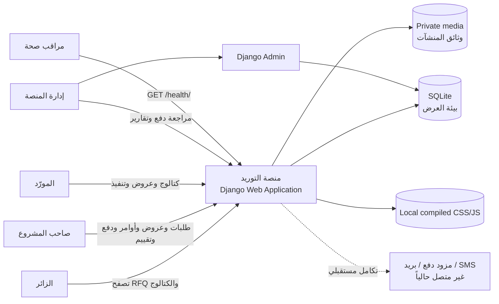
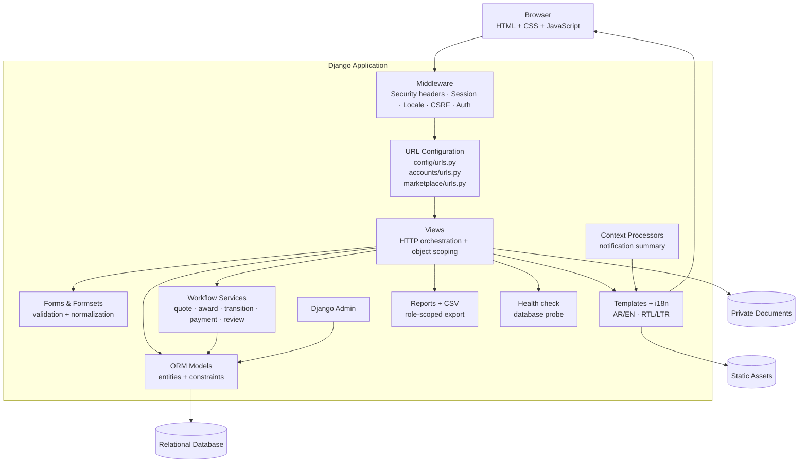
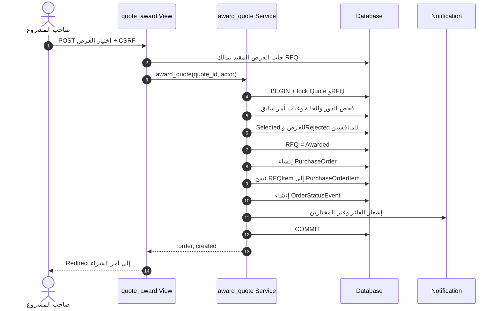
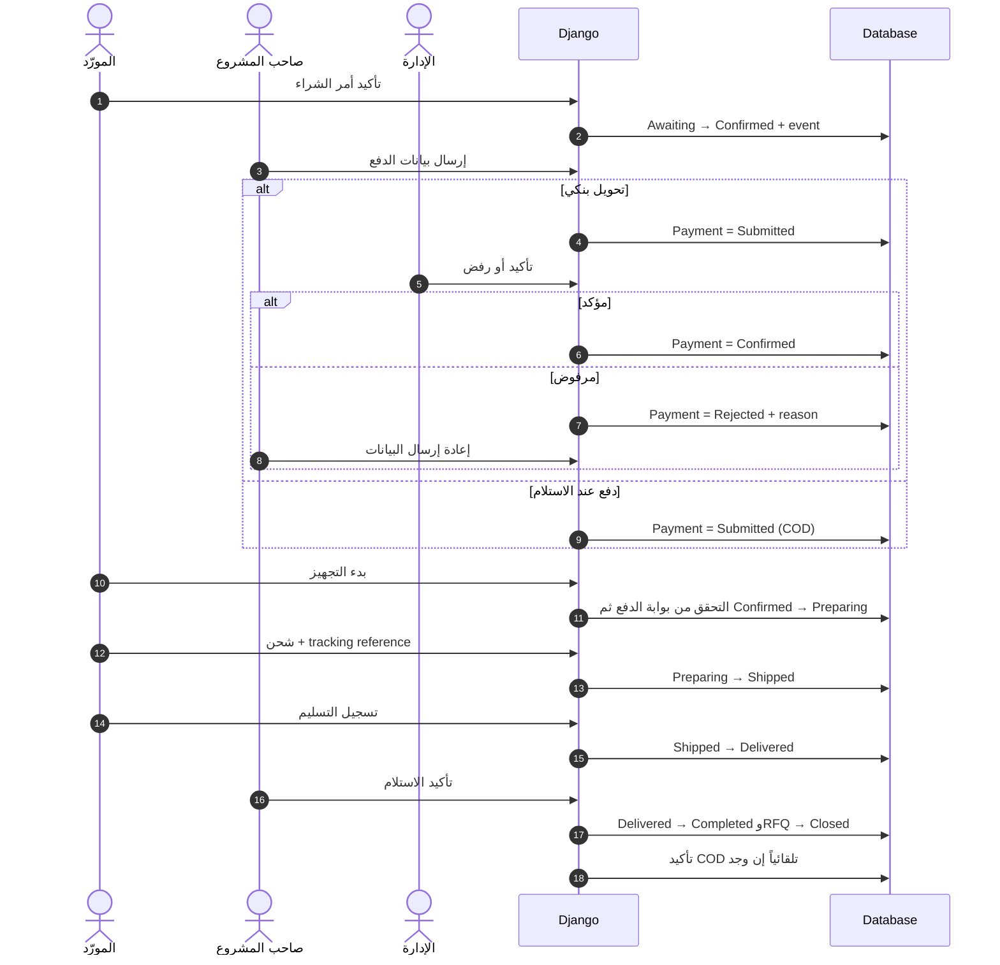
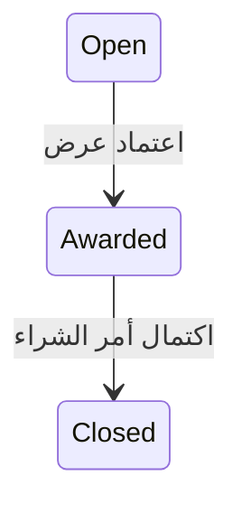
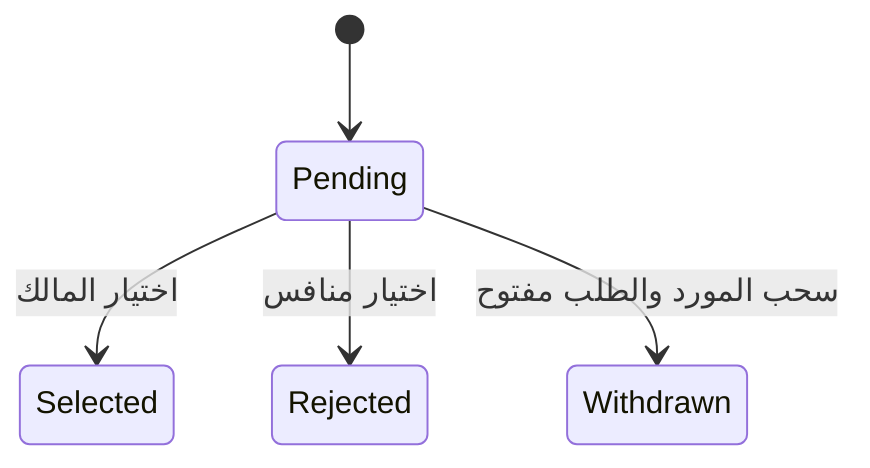
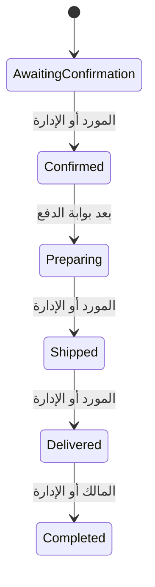
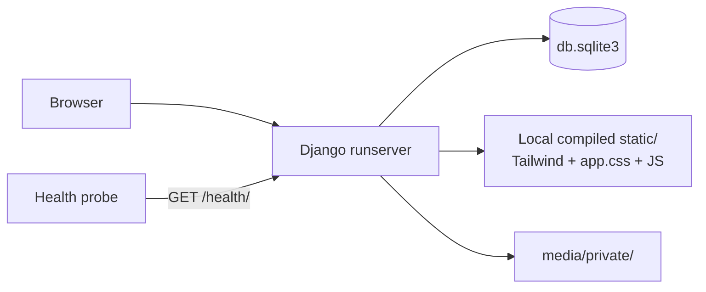
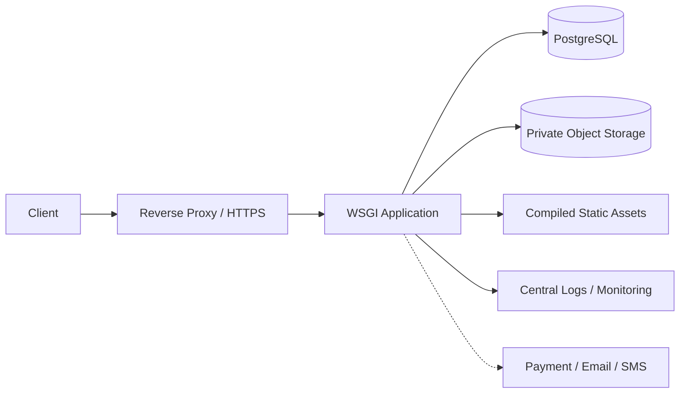

# معمارية النظام ونموذج البيانات

## 1. نظرة عامة

يعتمد المشروع معمارية Django متعددة الطبقات مع صفحات مولّدة من الخادم. لا
يوجد frontend منفصل أو REST API في النسخة الحالية؛ المتصفح يرسل HTTP إلى
Django، وتنفذ Views وForms التحقق، بينما تجمع `marketplace/services.py`
انتقالات سير العمل الحساسة داخل معاملات قاعدة بيانات.

## 2. سياق النظام



## 3. مخطط المكونات



## 4. مسؤوليات الوحدات

| الوحدة | المسؤولية |
|---|---|
| `config` | الإعدادات العامة، CSP/security middleware، اللغات، static/media، health والمسارات |
| `accounts.models` | المستخدم المخصص، الدور، ملف المنشأة ووثيقة التسجيل |
| `accounts.forms/views` | التسجيل، البريد الفريد، عرض/تعديل الملف والتنزيل المصرح للوثيقة |
| `marketplace.models` | التصنيفات والكتالوج وRFQ والعروض والأوامر والدفع والتقييم والإشعارات |
| `marketplace.forms` | تحقق حقول RFQ والبنود والعرض والمنتج والدفع والتقييم |
| `marketplace.views` | الصلاحيات، البحث، pagination، الدرجة الاستشارية، CSV، health وقوالب العرض |
| `marketplace.services` | إرسال/تعديل/سحب العرض والعمليات الذرية وقواعد الحالة والإشعارات |
| `marketplace.management` | بناء أربع حالات demo وكتالوج وإعادة ضبط حسابات العرض فقط |
| `templates` | الواجهة المولدة من الخادم وهوية الجامعة والتعريب |
| `locale` | كتالوج gettext للواجهة العربية |
| `assets` و`static` | مصدر Tailwind وبناء CSS محلياً، JavaScript والصور والشعار |

## 5. نموذج الكيانات والعلاقات ERD

```mermaid
erDiagram
    USER ||--o| COMPANY_PROFILE : "يمتلك"
    USER ||--o{ PRODUCT : "المورد يعرض"
    CATEGORY ||--o{ PRODUCT : "يصنف"
    USER ||--o{ RFQ : "المالك ينشر"
    CATEGORY ||--o{ RFQ : "يصنف"
    RFQ ||--|{ RFQ_ITEM : "يحتوي"
    RFQ ||--o{ QUOTE : "يستقبل"
    USER ||--o{ QUOTE : "المورد يقدم"
    RFQ ||--o| PURCHASE_ORDER : "ينتج"
    QUOTE ||--o| PURCHASE_ORDER : "يتحول عند الاختيار"
    PURCHASE_ORDER ||--|{ PURCHASE_ORDER_ITEM : "يحفظ snapshot"
    PURCHASE_ORDER ||--o{ ORDER_STATUS_EVENT : "يسجل"
    PURCHASE_ORDER ||--o| PAYMENT : "له"
    PURCHASE_ORDER ||--o| REVIEW : "له"
    USER ||--o{ NOTIFICATION : "يستقبل"
    USER o|--o{ NOTIFICATION : "ينشئ الحدث"
    RFQ o|--o{ NOTIFICATION : "سياق اختياري"
    PURCHASE_ORDER o|--o{ NOTIFICATION : "سياق اختياري"

    USER {
        bigint id PK
        string username UK
        string email "Unique case-insensitive"
        string role "owner|supplier|staff"
        string phone
        boolean email_verified
        boolean is_staff
    }

    COMPANY_PROFILE {
        bigint id PK
        bigint user_id FK_UK
        string trade_name
        string business_type
        string city
        string registration_number
        file registration_document
        boolean is_verified
        datetime updated_at
    }

    CATEGORY {
        bigint id PK
        string name UK
        string name_en
        string slug UK
    }

    PRODUCT {
        bigint id PK
        bigint supplier_id FK
        bigint category_id FK
        string sku
        string name
        string unit "Unit code"
        decimal minimum_order_quantity
        decimal price
        boolean is_active
    }

    RFQ {
        bigint id PK
        bigint owner_id FK
        bigint category_id FK
        string title
        date deadline
        decimal budget_min
        decimal budget_max
        string status
    }

    RFQ_ITEM {
        bigint id PK
        bigint rfq_id FK
        string name
        decimal quantity
        string unit "Unit code"
        string specifications
    }

    QUOTE {
        bigint id PK
        bigint rfq_id FK
        bigint supplier_id FK
        decimal total_amount
        int delivery_days
        string status
        datetime updated_at
    }

    PURCHASE_ORDER {
        bigint id PK
        bigint rfq_id FK_UK
        bigint quote_id FK_UK
        string order_number UK
        decimal agreed_amount
        string currency
        int delivery_days
        date expected_delivery_date
        string tracking_reference
        string status
        datetime completed_at
    }

    PURCHASE_ORDER_ITEM {
        bigint id PK
        bigint order_id FK
        string name
        decimal quantity
        string unit "Unit code"
        string specifications
    }

    ORDER_STATUS_EVENT {
        bigint id PK
        bigint order_id FK
        bigint actor_id FK
        string actor_role
        string from_status
        string to_status
        string note
        datetime created_at
    }

    PAYMENT {
        bigint id PK
        bigint order_id FK_UK
        string method
        decimal amount
        string status
        string reference
        string admin_note
        int submission_count
        bigint confirmed_by_id FK
    }

    REVIEW {
        bigint id PK
        bigint order_id FK_UK
        int rating
        string comment
    }

    NOTIFICATION {
        bigint id PK
        bigint user_id FK
        bigint actor_id FK
        bigint rfq_id FK
        bigint order_id FK
        string kind
        string event_key UK
        json payload "سياق الحدث الثابت"
        boolean is_read
        datetime created_at
    }
```

## 6. القيود البنيوية المهمة

| القيد | الغرض |
|---|---|
| Email فريد باستخدام `Lower(email)` | منع تكرار البريد باختلاف الأحرف |
| `(supplier, product.name)` فريد | منع تكرار اسم عنصر الكتالوج للمورد |
| `minimum_order_quantity > 0` | سلامة كمية الطلب الدنيا |
| `(rfq, supplier)` فريد في Quote | عرض واحد لكل مورد |
| Selected واحد مشروط لكل RFQ | منع فائزين على مستوى قاعدة البيانات |
| RFQ وQuote بعلاقة OneToOne مع PurchaseOrder | أمر شراء واحد للاتفاق |
| `agreed_amount > 0` و`delivery_days >= 1` | سلامة العقد |
| `PurchaseOrderItem.quantity > 0` | سلامة snapshot |
| Payment وReview بعلاقة OneToOne مع الأمر | دفع وتقييم واحدان |
| Rating بين 1 و5 | سلامة التقييم |
| `Notification.event_key` فريد | جعل إرسال الحدث idempotent |
| `Notification.payload` | حفظ عنوان الطلب/حالة الأمر وقت الحدث بدلاً من قراءة آخر حالة فقط |
| `Unit.TextChoices` | تخزين رموز piece/project/service/carton/kilogram وترجمتها وقت العرض |

## 7. مخطط تسلسل اعتماد العرض



تجمع الخدمة العملية كلها في `transaction.atomic`. يعالج قيد العرض الفائز
الواحد التعارض على مستوى البيانات أيضاً. أقفال `select_for_update` تكون ذات
دلالة كاملة عند استخدام PostgreSQL؛ SQLite مناسب للعرض لكنه لا يقدم السلوك
نفسه في التزامن.

## 8. مخطط تسلسل الدفع والتنفيذ



## 9. آلات الحالات الفعلية



`Draft` و`Evaluating` و`Cancelled` معرفة في RFQ، لكن النسخة الحالية لا تقدم
واجهة عامة لإدارتها. الخدمة تقبل الاختيار في `Open` أو `Evaluating`.





حالة `Cancelled` معرفة في PurchaseOrder ولا توجد حالياً عملية انتقال إليها.

## 10. قرارات معمارية

### 10.1 Django Templates بدلاً من SPA

- يقلل تعقيد مشروع التخرج ويستفيد من auth وCSRF وforms مباشرة.
- يجعل الصلاحيات وتوليد الواجهة في تطبيق واحد.
- المقايضة: لا توجد API مستقلة أو تحديثات لحظية.

### 10.2 Service Layer للعمليات الحرجة

- يمنع تكرار منطق الحالات في Views.
- يسهل اختبار العمليات كوحدة عمل واحدة.
- يحفظ قواعد الصلاحية قرب المعاملة الذرية.

### 10.3 Snapshot لأمر الشراء

لا يعتمد أمر الشراء على القيم القابلة للتعديل في RFQ فقط؛ تنسخ البنود والسعر
والمدة عند الاختيار، ما يحفظ أثر الاتفاق.

### 10.4 دفع يدوي

يعرض المشروع سير الموافقة دون الادعاء بأنه بوابة مالية. لا تخزن بيانات
بطاقات أو كلمات مرور مصرفية. التكامل الحقيقي يحتاج مزوداً وwebhooks وتسوية.

### 10.5 درجة قرار شفافة

تحتسب View المقارنة درجة إرشادية من 100:

```text
score =
  (lowest_amount / quote_amount) × 50
  + (fastest_days / quote_days) × 30
  + (supplier_rating / 5) × 20
```

يعطى المورد بلا تقييم قيمة افتراضية 3/5. تستبعد العروض المسحوبة، ويظهر أعلى
Score كتوصية لا كقرار آلي؛ اعتماد العرض يبقى POST صريحاً من مالك RFQ.

### 10.6 أصول محلية وسياسات متصفح

- يبنى Tailwind 3.4.17 إلى `static/css/tailwind.css` عبر npm ولا يحمل من CDN.
- يضيف middleware محلي CSP وReferrer-Policy وPermissions-Policy.
- تسمح CSP الحالية بـ`unsafe-inline` للنصوص البرمجية والتنسيقات اللازمة
  للواجهة؛ إزالة inline code واستخدام nonce تحسين إنتاجي لاحق.
- تصدير CSV يستخدم queryset الصلاحيات نفسه لأوامر المستخدم ويحيّد بدايات
  الصيغ الخطرة.
- `/health/` ينفذ `SELECT 1` ويعيد 200 أو 503، وهو فحص database readiness
  بسيط وليس مراقبة شاملة.

## 11. بنية النشر

### الحالية للعرض



### المقترحة للإنتاج



المخطط الثاني هدف مستقبلي وليس وصفاً لبنية منشورة حالياً.
