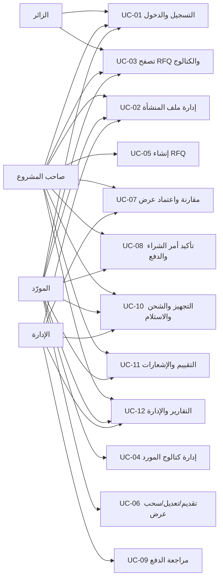

# حالات الاستخدام

## 1. الأطراف

| الرمز | الطرف | الوصف |
|---|---|---|
| A-01 | الزائر | مستخدم غير مسجل يستطيع تصفح المحتوى العام |
| A-02 | صاحب المشروع | ينشر الاحتياج ويتعاقد ويتابع ويقيّم |
| A-03 | المورّد | يعرض المنتجات ويقدم عرض السعر وينفذ الأمر |
| A-04 | إدارة المنصة | تراجع الدفع والتوثيق وتتدخل إدارياً |

## 2. خريطة حالات الاستخدام

## UC-01 — التسجيل والدخول

| البند | الوصف |
|---|---|
| الأطراف | زائر، صاحب مشروع، مورد |
| الشرط السابق | لا توجد جلسة دخول |
| المحفز | اختيار «إنشاء حساب» |
| المدخلات | username، بريد، هاتف، اسم منشأة، دور، كلمتا المرور |
| النتيجة | User وCompanyProfile وجلسة مصادقة |

### المسار الأساسي

1. يختار المستخدم Owner أو Supplier.
2. يتحقق Django من اسم المستخدم وكلمة المرور.
3. يحول البريد إلى أحرف صغيرة ويرفض تكراره دون حساسية لحالة الأحرف.
4. ينشئ الحساب وملف المنشأة ويسجل المستخدم دخوله.
5. يعاد توجيهه إلى لوحة التحكم المناسبة.

### البدائل

- البريد أو اسم المستخدم موجود: تعرض أخطاء الحقول ولا ينشأ الحساب.
- كلمة المرور ضعيفة أو غير متطابقة: تطبق validators الخاصة بـDjango.
- مستخدم مسجل يفتح صفحة التسجيل: يعاد إلى لوحة التحكم.

> `email_verified` موجود في البيانات، لكن إرسال رابط تحقق بريدي غير منفذ.

## UC-02 — إدارة ملف المنشأة ووثيقتها

| البند | الوصف |
|---|---|
| الأطراف | صاحب مشروع، مورد، إدارة |
| الشرط السابق | تسجيل الدخول |
| المدخلات | الاسم التجاري، نوع العمل، المدينة، الوصف، رقم التسجيل، الوثيقة |
| النتيجة | ملف منشأة محدث ونسبة اكتمال محسوبة |

### المسار الأساسي

1. يفتح المستخدم ملف منشأته.
2. يعدل البيانات ويرفع PDF/JPG/JPEG/PNG لا يتجاوز 5MB.
3. يتحقق Form من الامتداد والحجم وتوقيع PDF/PNG/JPEG الأساسي، ثم يحفظ الملف
   باسم عشوائي ضمن مسار خاص.
4. يستطيع صاحب الوثيقة أو الإدارة تنزيلها من view مصرح.
5. تستطيع الإدارة تغيير حالة التوثيق من Django Admin.
6. يؤدي تغيير الاسم القانوني أو رقم/وثيقة التسجيل إلى إعادة `is_verified`
   تلقائياً إلى False حتى تراجع الإدارة البيانات الجديدة.

### البدائل والقيود

- ملف أكبر من 5MB أو امتداده غير مسموح: يرفض.
- مستخدم يحاول تنزيل وثيقة منشأة أخرى: يعاد 404.
- الوثيقة ليست منشورة في ملف المورد العام أو الكتالوج.
- فحص التوقيع يمنع ملفاً نصياً متنكرًا بامتداد مسموح، لكنه لا يعوض فحص
  malware أو تحليل MIME عميقاً.

## UC-03 — تصفح الطلبات والكتالوج

| البند | الوصف |
|---|---|
| الأطراف | الجميع |
| الشرط السابق | لا يوجد |
| النتيجة | قائمة عامة مقيدة بالمحتوى القابل للنشر |

### RFQ

1. يعرض النظام الطلبات `Open` التي لم يمر تاريخها.
2. يمكن البحث بالعنوان أو الوصف أو المدينة والتصفية بالتصنيف.
3. تقسم القائمة إلى 9 طلبات في الصفحة.
4. تعرض التفاصيل والبنود دون كشف عروض الموردين للعموم.

### الكتالوج

1. يعرض النظام المنتجات النشطة لموردين موثقين فقط.
2. يدعم البحث بالاسم والوصف وSKU واسم المورد، والتصنيف.
3. تقسم النتائج إلى صفحات من 12 عنصراً.
4. يمكن فتح المنتج وملف المورد العام.

## UC-04 — إدارة كتالوج المورد

| البند | الوصف |
|---|---|
| الطرف | المورد |
| الشرط السابق | مستخدم دوره Supplier |
| المدخلات | تصنيف، SKU، اسم، وصف، وحدة، حد أدنى، سعر مرجعي، حالة |
| النتيجة | عنصر كتالوج مملوك للمورد |

### المسار الأساسي

1. يفتح المورد «منتجاتي وخدماتي».
2. يضيف عنصراً بكمية دنيا موجبة وسعر موجب عند إدخاله.
3. يعدل العنصر أو يبدل حالته Active/Inactive.
4. يظهر العنصر للعامة فقط عندما يكون نشطاً وصاحب الحساب موثقاً.

### البدائل

- مستخدم غير Supplier: 404.
- تعديل عنصر مورد آخر: 404.
- تكرار الاسم للمورد نفسه: يمنعه قيد قاعدة البيانات.
- لا يوجد حذف نهائي من الواجهة؛ يستخدم التعطيل للحفاظ على السجل.

## UC-05 — إنشاء طلب عرض سعر

| البند | الوصف |
|---|---|
| الطرف | صاحب المشروع |
| الشرط السابق | مستخدم دوره Owner |
| المدخلات | العنوان، التصنيف، الوصف، المدينة، الموعد، الميزانية، البنود |
| النتيجة | RFQ بحالة Open |

### المسار الأساسي

1. يملأ المالك بيانات الطلب.
2. يضيف بنداً واحداً على الأقل مع كمية موجبة.
3. يتحقق النظام أن الموعد اليوم أو لاحق وأن الحد الأعلى لا يقل عن الأدنى.
4. تحفظ RFQ وبنودها ضمن معاملة واحدة.
5. تظهر للعموم وقائمة الموردين حتى نهاية الموعد.

### البدائل

- مورد يحاول الإنشاء: 403.
- بند ناقص أو موعد ماضٍ أو ميزانية غير منطقية: لا يحفظ الطلب.
- الحفظ كمسودة، التعديل والإلغاء غير موصولة بواجهة حالياً.

## UC-06 — تقديم عرض وتعديله أو سحبه

| البند | الوصف |
|---|---|
| الطرف | المورد |
| الشرط السابق | مورد موثق وRFQ مفتوح وغير منتهٍ للتقديم أو التعديل |
| المدخلات | المبلغ الإجمالي، مدة التسليم بالأيام، ملاحظات |
| النتيجة | Quote بحالة Pending وإشعار للمالك |

### المسار الأساسي

1. يفتح المورد RFQ.
2. يرسل مبلغاً موجباً ومدة لا تقل عن يوم.
3. يحفظ العرض ويصل إشعار داخلي للمالك.
4. يظهر العرض في «عروضي».
5. يستطيع المورد تعديل Pending قبل الموعد.

### السحب

- يستطيع مالك العرض تحويله من Pending إلى Withdrawn قبل الموعد وما دام RFQ
  مفتوحاً.
- العرض المسحوب لا يمكن اختياره.
- لا تنشئ النسخة الحالية عرضاً جديداً بديلاً لأن قيد العرض الواحد يبقى قائماً.

### الاستثناءات

- انتهاء الموعد أو تغير حالة RFQ: 404 عند التقديم/التعديل.
- مورد غير موثق: لا يقبل العرض ويعاد إلى ملف المنشأة لإكماله وانتظار الإدارة.
- عرض سابق للمورد نفسه: لا ينشأ عرض ثانٍ.
- مورد آخر يحاول تعديل العرض: 404.

## UC-07 — مقارنة العروض واعتماد الفائز

| البند | الوصف |
|---|---|
| الطرف الأساسي | صاحب RFQ |
| طرف قراءة | الإدارة |
| الشرط السابق | عروض على RFQ بحالة Open أو Evaluating |
| النتيجة | فائز واحد، رفض المنافسين، وأمر شراء |

### المسار الأساسي

1. يعرض النظام كل عرض غير مسحوب مع السعر والمدة والمورد والتقييم.
2. يحسب الأدنى والأسرع ومتوسط الأسعار.
3. يحسب لكل عرض درجة إرشادية من 100:
   `(أقل سعر/السعر × 50) + (أسرع مدة/المدة × 30) + (التقييم/5 × 20)`.
   يستخدم 3/5 عند عدم وجود تقييم، ويبرز أعلى درجة كتوصية شفافة.
4. يختار المالك عرضاً Pending ويؤكد POST؛ لا تعتمد التوصية تلقائياً.
5. تقفل الخدمة السجلات داخل معاملة وتعيد فحص الصلاحية والحالة.
6. يصبح العرض Selected والمنافسون Pending يصبحون Rejected.
7. يصبح RFQ بحالة Awarded.
8. ينشأ أمر شراء وتنسخ البنود والقيمة والمدة.
9. يسجل أول OrderStatusEvent وترسل الإشعارات.

### الاستثناءات

- مستخدم غير مالك RFQ: لا يصل لمسار الاعتماد.
- العرض مسحوب/مرفوض أو RFQ مغلق: ترفض العملية.
- إعادة POST على الفائز نفسه: تعيد أمر الشراء القائم دون إنشاء نسخة.
- محاولة اختيار منافس بعد التعاقد: ترفض ويبقى الفائز الأول.

## UC-08 — تأكيد الأمر وتسجيل الدفع

| البند | الوصف |
|---|---|
| الأطراف | المورد المختار، صاحب المشروع |
| الشرط السابق | أمر شراء Awaiting Confirmation |
| النتيجة | أمر Confirmed ثم Payment Submitted |

### المسار الأساسي

1. يؤكد المورد قبول الأمر، فيصبح Confirmed.
2. يختار المالك Bank Transfer أو Cash on Delivery.
3. يثبت النظام مبلغ الدفع من `agreed_amount`.
4. يحتاج التحويل إلى reference؛ COD لا يحتاجه.
5. يحفظ Payment بحالة Submitted ويرسل الإشعارات.

### البدائل

- لا يمكن الدفع قبل تأكيد المورد.
- الدفع المؤكد لا يعاد إرساله.
- الدفع المرفوض يمكن إعادة إرساله ويزداد `submission_count`.

## UC-09 — مراجعة بيانات الدفع

| البند | الوصف |
|---|---|
| الطرف | الإدارة |
| الشرط السابق | Payment بحالة Submitted وقابل للمراجعة |
| النتيجة | Confirmed أو Rejected |

### المسار الأساسي

1. تفتح الإدارة طلب المراجعة.
2. تقارن المرجع والملاحظات خارج النظام مع إثبات التحويل المتاح لها.
3. تؤكد أو ترفض.
4. يتطلب الرفض سبباً إدارياً.
5. تصل النتيجة إلى المالك والمورد.

### القيود

- العملية تسجيل قرار إداري وليست اتصالاً بالبنك.
- لا تدخل كلمات مرور أو PIN أو بيانات بطاقة.
- COD يسمح بالتجهيز بعد الإرسال ويؤكد تلقائياً عند إكمال الطلب؛ لا ينبغي
  تطبيق قرار إداري متأخر عليه بعد بدء التنفيذ.

## UC-10 — التجهيز والشحن والتسليم والإكمال

| المرحلة | منفذها المعتاد | الشرط |
|---|---|---|
| Confirmed → Preparing | المورد | Payment Confirmed أو COD Submitted |
| Preparing → Shipped | المورد | يمكن إضافة tracking reference |
| Shipped → Delivered | المورد | تسجيل وصول الشحنة |
| Delivered → Completed | صاحب المشروع | تأكيد الاستلام |

الإدارة تستطيع تنفيذ الانتقال التالي لأغراض التدخل التشغيلي. كل انتقال يعيد
التحقق من الحالة الحالية، ويسجل Event ويرسل إشعاراً للطرف الآخر. عند
Completed:

- يحفظ `completed_at`.
- يغلق RFQ.
- يؤكد COD المرسل تلقائياً.

لا توجد حالياً واجهة إلغاء أو رجوع إلى حالة سابقة.

## UC-11 — التقييم والإشعارات

### التقييم

1. يظهر خيار التقييم للمالك بعد Completed.
2. يقبل النظام تقييماً 1–5 وتعليقاً اختيارياً.
3. يمنع التقييم قبل الإكمال أو من مستخدم آخر أو للمرة الثانية.
4. يصل إشعار للمورد ويدخل التقييم في متوسط ملفه.

### الإشعارات

- القائمة مقيدة بالمستخدم الحالي.
- فتح الإشعار وتحديد الكل كمقروء عمليات POST.
- يحمل الإشعار سياق RFQ أو أمر الشراء عندما ينطبق.
- يحفظ payload الحالة أو العنوان وقت إنشاء الحدث حتى لا تتغير الرسالة تاريخياً.
- `event_key` يمنع تكرار إشعار الحدث نفسه.

## UC-12 — التقارير والإدارة

### صاحب المشروع

- عدد RFQs والأوامر والإنفاق الإجمالي والأوامر المكتملة والمفتوحة.

### المورد

- عدد العروض والأوامر والإيراد الاسمي ومعدل الفوز ومتوسط التقييم.

### الإدارة

- المستخدمون وRFQs والأوامر وحجم الأوامر والمدفوعات المعلقة.

تعرض كل لوحة توزيع حالات الأوامر. يستطيع المستخدم تنزيل CSV يحتوي أوامره
المصرح بها فقط، مع BOM لبرامج الجداول وتحييد بدايات صيغ CSV. المؤشرات بلا
نطاق تاريخي أو PDF، ومبالغها تفترض العملة الحالية الموحدة.

### Django Admin

- إدارة المستخدمين وملفات المنشآت والتوثيق والتصنيفات وبيانات السوق.
- ليس بديلاً عن نظام نزاعات أو محاسبة أو لوحة تدقيق وثائق متخصصة.

## UC-13 — صحة النظام وبيئة العرض

- يطلب مراقب أو عضو الفريق `/health/`.
- ينفذ النظام استعلام `SELECT 1`.
- يعيد `{"status":"ok"}` مع 200 عند عمل قاعدة البيانات، أو
  `{"status":"unavailable"}` مع 503 عند فشلها.
- يستطيع فريق العرض تشغيل `python manage.py seed_demo --reset` لحذف بيانات
  الحسابات التجريبية الأربعة فقط وإعادة بناء:
  - طلب مقارنة بعرضين.
  - أمر بحالة Shipped وCOD.
  - طلب Open بعرض.
  - أمر Completed بدفع مؤكد وتقييم.
  - أربعة عناصر كتالوج.

Health لا يفحص التخزين أو البريد أو الدفع الخارجي، وreset ليس لإنتاج حقيقي.

## 3. سيناريوهات إساءة يمنعها النظام

| السيناريو | آلية المنع |
|---|---|
| مورد ينشئ RFQ | فحص الدور وإرجاع 403 |
| مالك آخر يفتح أمر الشراء | Queryset مقيد وإرجاع 404 |
| مورد يعدل منتج/عرض مورد آخر | فلترة الملكية وإرجاع 404 |
| مستخدم ينزل وثيقة غيره | شرط صاحب الوثيقة أو Staff |
| عرض بعد الموعد | فلترة deadline من الخادم |
| عرضان للمورد نفسه | فحص التطبيق + UniqueConstraint |
| فائزان للطلب | transaction + UniqueConstraint مشروط |
| بدء التجهيز قبل الدفع | guard في service |
| المورد يؤكد الاستلام | transition ownership يمنعه |
| تقييم مبكر أو متكرر | فحص الحالة + OneToOne |
| فتح إشعار مستخدم آخر | queryset للمستخدم الحالي |
| تصدير أوامر طرف آخر | CSV يستخدم `_orders_for_user` نفسه |
| CSV يبدأ بصيغة spreadsheet | إضافة apostrophe للقيم التي تبدأ `= + - @` |
| ملف نصي باسم PDF | فحص magic signature قبل الحفظ |
| تغيير بيانات قانونية بعد التوثيق | إعادة حالة التوثيق إلى False |
