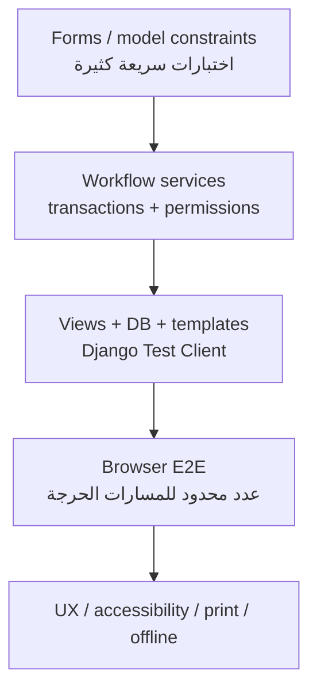

# خطة الاختبار وتقرير النتائج

## 1. بيانات التقرير

| البند | القيمة |
|---|---|
| المشروع | منصة التوريد — جامعة الشام |
| التاريخ | 27 تموز 2026 |
| إطار الاختبار | `django.test.TestCase` وDjango test client |
| قاعدة الاختبار | قاعدة مؤقتة ينشئها Django ثم يحذفها |
| بيئة التقرير | Python 3، Django 5.2، توقيت Asia/Damascus |
| حالة التحقق النهائي | مكتمل — جميع الفحوص الآلية المذكورة أدناه ناجحة |

## 2. الأهداف

- التحقق من قواعد RFQ والعرض الواحد واعتماد الفائز.
- إثبات الصلاحيات على مستوى الدور والكائن.
- التحقق من معاملات أمر الشراء وبوابة الدفع.
- التحقق من التسلسل الكامل حتى الاستلام والتقييم.
- التحقق من خصوصية الإشعارات وثبات سياقها التاريخي.
- التحقق من الملف والوثيقة الخاصة والكتالوج وإدارة العرض.
- التحقق من الدرجة الاستشارية والأصول المحلية وسياسات الأمن وCSV وhealth.
- التحقق من العربية/الإنجليزية واتجاه الصفحة والثيم.
- منع regressions قبل نسخة المناقشة.

## 3. أوامر التحقق

```bash
python manage.py test
python manage.py makemigrations --check --dry-run
python manage.py check
npm run css:build
msgattrib --untranslated locale/ar/LC_MESSAGES/django.po
msgattrib --only-fuzzy locale/ar/LC_MESSAGES/django.po
DJANGO_DEBUG=0 \
DJANGO_SECRET_KEY='replace-with-a-long-random-secret' \
DJANGO_ALLOWED_HOSTS='example.com' \
python manage.py check --deploy
```

الأمر الأخير يفحص الإعدادات مع قيم تمثيلية فقط، ولا يعني وجود نشر إنتاجي.

## 4. النتيجة النهائية

| الفحص | النتيجة |
|---|---|
| الاختبارات الآلية | **نجاح: 52/52**، دون failures أو errors أو skips، خلال 10.215 ثانية |
| System check ضمن الاختبارات | **نجاح: 0 issues** (`0 silenced`) |
| `python manage.py check` | **نجاح: 0 issues** (`0 silenced`) |
| Migrations check | **نجاح: `No changes detected`** |
| Deploy check مع env | **نجاح: 0 issues** (`0 silenced`) |
| بناء Tailwind المحلي | **نجاح**، أنشئ CSS المصغّر خلال 647ms |
| gettext untranslated/fuzzy | **نجاح: 0 untranslated و0 fuzzy** |

نفذت هذه الجولة بتاريخ **27 تموز 2026** على نسخة العمل الحالية. ظهر أثناء بناء
Tailwind تنبيه غير حاجب بأن بيانات `caniuse-lite` قديمة؛ لا يؤثر في نجاح البناء،
ويحدّث لاحقاً ضمن صيانة الاعتماديات.

## 5. مجموعة الاختبارات الموجودة

### 5.1 التدفق الأساسي

الملف: `marketplace/tests.py`

| المجموعة | ما تتحقق منه |
|---|---|
| `MarketplaceFlowTests` | تصفح RFQ، منع المورد من إنشائه، إنشاء RFQ ببند، منع العرض الثاني |
| `InternationalizationTests` | العربية RTL، حفظ English/LTR، اسم التصنيف حسب اللغة، زر الثيم |

### 5.2 سير التعاقد

الملف: `marketplace/test_workflow.py`

| المجموعة | أهم الحالات |
|---|---|
| `QuoteAwardTests` | أمر متسق، idempotency، منع استبدال الفائز، صلاحية المالك، إعادة التحقق من نشاط المورد وتوثيقه، POST وCSRF |
| `QuoteSubmissionTests` | منع العرض بعد الموعد وقبول عرض يوم الموعد وإشعار المالك |
| `OrderPermissionAndTransitionTests` | scoping، ملكية الانتقال، بوابة الدفع، COD end-to-end، منع GET |
| `ManualPaymentTests` | مرجع التحويل، مبلغ الأمر، قرار Staff، إعادة الإرسال، قفل COD بعد بدء التجهيز |
| `ReviewWorkflowTests` | منع التقييم المبكر، تقييم واحد، منع غير المالك |
| `NotificationPermissionTests` | snapshot حالة الإشعار، فتح رفض آمن، scoping، mark-all-read |

### 5.3 الحساب والوثائق

الملف: `accounts/tests.py`

| المجموعة | أهم الحالات |
|---|---|
| `AccountAndVerificationTests` | البريد دون حساسية الأحرف، توقيع الملف، إلغاء التوثيق بعد تعديل قانوني، منع نموذج قديم من استعادة توثيق ألغته الإدارة، تنزيل خاص، إنشاء ملف لحساب قديم |

### 5.4 الكتالوج والتحسينات التشغيلية

الملف: `marketplace/test_catalog.py`

| المجموعة | أهم الحالات |
|---|---|
| `CatalogAndQuoteManagementTests` | كتالوج الموثق، ملكية المنتج، شرط التوثيق، تعديل/سحب العرض، درجة 50/30/20 والتعامل مع غياب أي عرض مؤهل، Tailwind محلي وCSP، تحييد CSV، health، ومنع seed خارج DEBUG |

إجمالي الحالات موزع كالتالي: 8 في التدفق الأساسي والترجمة، و26 في سير
التعاقد، و6 للحساب والوثائق، و12 للكتالوج والتحسينات التشغيلية.

## 6. تغطية المتطلبات

| المتطلب | الاختبار الآلي الحالي | الحالة |
|---|---|---|
| FR-008 إنشاء RFQ | `test_owner_can_create_rfq_with_item` | مغطى بالمسار السعيد |
| FR-010/011 تقديم عرض واحد والموعد | Quote submission + basic flow | مغطى |
| FR-013 خصوصية العروض | Workflow وملكية التعديل والسحب | مغطى عملياً |
| FR-015/016 اعتماد عرض وsnapshot | QuoteAwardTests | مغطى جيداً، ويمنع اعتماد مورد غير موثق أو غير نشط |
| FR-017–022 سير الأمر والدفع | Order + ManualPayment tests | مغطى جيداً |
| FR-023 التقييم | ReviewWorkflowTests | مغطى |
| FR-024 الإشعارات | NotificationPermissionTests | مغطى جيداً |
| FR-027 اللغة والثيم | InternationalizationTests | اللغة مغطاة؛ JavaScript يراجع يدوياً |
| FR-001/002 التسجيل والبريد الفريد | AccountAndVerificationTests | مغطى جزئياً |
| FR-003/004 الملف والوثيقة الخاصة | AccountAndVerificationTests | مغطى جيداً، بما فيه سباق نموذج قديم مع إلغاء التوثيق |
| FR-006/007 الكتالوج والملكية | CatalogAndQuoteManagementTests | مغطى في المسارات الحرجة |
| FR-012 تعديل وسحب العرض | CatalogAndQuoteManagementTests | مغطى |
| FR-014 الدرجة الاستشارية | `test_comparison_displays_transparent_decision_score` | مغطى |
| FR-026 التقارير وCSV | اختبارات التنزيل و`test_csv_export_neutralizes_spreadsheet_formulas` | التصدير وتحييد الصيغ ومحارف التحكم مغطاة؛ metrics جزئية |
| FR-030 مؤشرات الصفحة | اختبار عرض الصفحة فقط | معادلة الوفر تحتاج unit test مستقلاً |
| FR-031 health | `test_health_endpoint_checks_database` | مسار النجاح مغطى؛ 503 يحتاج اختباراً |
| FR-032 صفحات الأخطاء | لا يوجد اختبار مخصص حالياً | تحتاج اختبار 403/404/500 مع `DEBUG=False` |
| FR-033 reset demo | `test_demo_seed_is_blocked_outside_debug_mode` | حاجز الإنتاج مغطى؛ إعادة البناء الحتمية تحتاج اختبار قاعدة مؤقتة |

## 7. فجوات آلية متبقية

- حد الملف 5MB والامتدادات المختلفة واختبار JPEG/PNG الصحيح.
- منع التعديل/السحب بعد الموعد أو بعد Awarded كحالات صريحة.
- البحث والتصنيف وpagination مع حفظ query parameters.
- scoping محتوى CSV بين الأدوار كحالة مستقلة.
- معادلة الوفر التقديري بحالات متعددة.
- فشل اتصال health وإرجاع 503.
- محتوى صفحات 403/404/500 في وضع `DEBUG=False`.
- قيود `Unit` وترجمة كل القيم.

## 8. اختبارات يدوية لنسخة المناقشة

| الرمز | الحالة | المتوقع |
|---|---|---|
| MT-01 | العربية | `lang=ar` و`dir=rtl` ومحاذاة سليمة |
| MT-02 | الإنجليزية | `lang=en` و`dir=ltr` ولا نصوص واجهة عربية غير مقصودة |
| MT-03 | الثيم | Light/Dark وحفظ الاختيار بعد reload |
| MT-04 | الهاتف | 360px دون overflow أفقي أو أزرار غير قابلة للوصول |
| MT-05 | لوحة المفاتيح | ترتيب focus منطقي وظهور focus وعدم حبس المستخدم |
| MT-06 | التباين | النصوص والأزرار الأساسية مقروءة في الثيمين |
| MT-07 | الطباعة | أمر شراء منظم دون navigation غير ضروري |
| MT-08 | offline | CSS/JS/الشعار تعمل دون شبكة خارجية |
| MT-09 | المستند الخاص | لا يمكن الوصول إليه عبر رابط media عام |
| MT-10 | السيناريو الكامل | Owner → Supplier → Staff → Supplier → Owner |

## 9. اختبارات غير منفذة بعد

- قياس coverage بالأداة ونشر نسبة موثقة.
- E2E بمتصفح حقيقي مثل Playwright.
- اختبار حمل وزمن استجابة وذاكرة.
- race-condition على PostgreSQL.
- فحص وصول آلي axe/WAVE وشهادة WCAG.
- فحص أمني SAST/DAST أو اختبار اختراق.
- اختبار backup/restore وdisaster recovery.
- اختبارات بوابة دفع أو بريد/SMS لأنها غير متكاملة.

لا ينبغي تحويل غياب هذه الاختبارات إلى ادعاء؛ تسجل كحد وخطة تطوير.

## 10. استراتيجية الاختبار المقترحة



التركيز الحالي جيد في service/integration لدورة الشراء، وقد أضيفت اختبارات
الحساب والكتالوج والتحسينات التشغيلية. تبقى اختبارات المتصفح والحمل والتزامن
خارج النسخة الحالية.

## 11. بوابة قبول نسخة المناقشة

لا تعتمد النسخة إلا عندما:

- [x] تنجح كل الاختبارات دون skip غير مبرر.
- [x] لا توجد migrations غير منشأة.
- [x] ينجح `check` و`check --deploy` مع env مناسبة.
- [x] ينجح بناء Tailwind المحلي، ولا تبقى ترجمات عربية ناقصة أو fuzzy.
- [ ] تعمل بيانات seed من قاعدة نظيفة.
- [ ] ينجح `seed_demo --reset` وسيناريو demo مرتين على الأقل.
- [ ] ينفذ MT-01 إلى MT-10 وتسجل النتائج.
- [ ] لا توجد أرقام وهمية أو أسرار أو وثائق خاصة ضمن repository.
- [ ] تحفظ نتيجة الاختبار النهائية مع التاريخ ونسخة commit/tag.

## 12. شكل دليل الاختبار

ينصح بحفظ مخرجات النسخة المثبتة في:

- `docs/evidence/test-results.txt`
- `docs/evidence/deploy-check.txt`
- `docs/evidence/manual-test-checklist.pdf`
- `docs/evidence/screenshots/`

ولا تعد ملفات الدليل بديلاً عن الأوامر القابلة لإعادة التشغيل.
