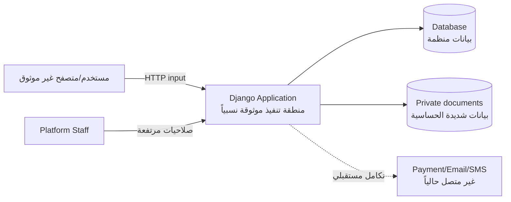

# الأمن والخصوصية والحدود وخارطة الطريق

## 1. هدف الوثيقة

توضح هذه الوثيقة الضوابط الموجودة فعلاً، وما لا تغطيه النسخة الحالية، وكيف
ينتقل المشروع من نموذج تخرج محلي إلى نظام إنتاجي. لا تمثل مراجعة اختراق أو
شهادة امتثال.

## 2. الأصول الحساسة

| التصنيف | أمثلة | الحساسية |
|---|---|---|
| هوية المستخدم | username، البريد، الهاتف، password hash | عالية |
| بيانات المنشأة | الاسم، المدينة، رقم التسجيل، الوصف | متوسطة |
| وثائق المنشأة | PDF/JPG/PNG للتسجيل | عالية وخاصة |
| بيانات التعاقد | RFQ، عروض الموردين، السعر، أمر الشراء | عالية تجارياً |
| الدفع اليدوي | المبلغ والمرجع والملاحظات والقرار | عالية |
| التقييمات | الدرجة والتعليق | متوسطة |
| الإشعارات والسجل | الممثل والحالة والوقت والملاحظات | متوسطة إلى عالية |
| static/هوية الجامعة | CSS، JS، الصور والشعار | عامة |

لا تخزن المنصة أرقام بطاقات أو CVV أو PIN أو كلمات مرور مصرفية.

## 3. حدود الثقة



كل قيمة من request أو ملف مرفوع أو ملاحظة مستخدم تعد غير موثوقة حتى تمر
بالتحقق والتفويض.

## 4. نموذج تهديد مختصر STRIDE

| التهديد | مثال | الضبط الحالي | المتبقي |
|---|---|---|---|
| Spoofing | انتحال مستخدم | جلسات Django، hashing، validators | لا 2FA ولا تحقق بريد فعلي |
| Tampering | تغيير حالة أمر عبر POST | CSRF، scoping، service guards، معاملات | لا توقيع رقمي أو AuditLog عام |
| Repudiation | إنكار تحديث حالة | OrderStatusEvent بالممثل والدور والوقت | تعديلات الملف/RFQ/Quote/Payment ليست كلها في سجل موحد |
| Information Disclosure | فتح أمر أو وثيقة غير مملوكة | querysets مقيدة و404، تنزيل وثيقة مصرح | يجب منع تقديم media الخاص مباشرة من خادم الإنتاج |
| Denial of Service | طلبات دخول/بحث أو ملفات كثيرة | حد 5MB للوثيقة | لا rate limiting أو quotas أو WAF |
| Elevation of Privilege | مورد ينفذ عملية مالك | فحص الدور والملكية من الخادم | يلزم مراجعة دورية واختبارات لكل endpoint جديد |

## 5. الضوابط المنفذة

### 5.1 المصادقة وكلمات المرور

- `AbstractUser` وpassword hashing الخاصان بـDjango.
- validators للتشابه والطول وكلمات المرور الشائعة والرقمية.
- البريد فريد دون حساسية لحالة الأحرف.
- التسجيل لا يسمح باختيار دور Staff.
- logout عبر POST في الواجهة.

### 5.2 التفويض

- `login_required` للصفحات الخاصة.
- فحص Owner/Supplier/Staff داخل Views وServices.
- قصر أوامر الشراء على المالك والمورد المختار والإدارة.
- قصر المنتجات والعروض على مالكها عند التعديل.
- قصر الإشعارات على مستلمها.
- قصر وثيقة المنشأة على صاحب الملف أو الإدارة.
- استخدام 404 في عدد من الموارد الخاصة لتقليل كشف وجودها.

### 5.3 سلامة الطلب

- CSRF middleware وtokens في النماذج.
- `require_POST` للإجراءات المغيرة للحالة مثل الاختيار والسحب وفتح الإشعار.
- Forms تتحقق من الأنواع والحدود والقيم.
- Django Templates تستخدم autoescaping افتراضياً لمحتوى المستخدم.
- ORM يقلل مخاطر SQL injection مقارنة بتجميع SQL يدوياً.
- `SecurityHeadersMiddleware` يضيف CSP وReferrer-Policy وPermissions-Policy.
- Tailwind CSS وJavaScript والصور تقدم محلياً ولا تنفذ شيفرة CDN.
- صفحات 403/404/500 مخصصة لا تكشف تفاصيل داخلية عند تعطيل DEBUG.

### 5.4 اتساق البيانات

- `transaction.atomic` للعمليات المركبة.
- `select_for_update` في اعتماد العرض وانتقالات الأمر والدفع والتقييم.
- UniqueConstraints تمنع العرض المتكرر والفائز الثاني.
- CheckConstraints للمبالغ والكميات والتقييم.
- `event_key` فريد لجعل الإشعار idempotent.
- snapshot للبنود والقيمة والمدة عند إنشاء أمر الشراء.
- تصدير CSV مقيد بـ`_orders_for_user` ويحيّد القيم البادئة بـ`= + - @`.

### 5.5 إعداد الإنتاج

عندما يكون `DJANGO_DEBUG=0` تفعل الإعدادات:

- `SECURE_SSL_REDIRECT`.
- `SESSION_COOKIE_SECURE`.
- `CSRF_COOKIE_SECURE`.
- HSTS لمدة سنة مع subdomains وpreload.

كما يجب ضبط `DJANGO_SECRET_KEY` و`DJANGO_ALLOWED_HOSTS` من البيئة.

السياسة الحالية هي:

```text
default-src 'self'
frame-ancestors 'none'
object-src 'none'
img-src 'self' data:
font-src 'self'
connect-src 'self'
```

وتسمح مؤقتاً بـ`'unsafe-inline'` في `style-src` و`script-src` لحاجة القوالب
الحالية؛ نقل السكربتات inline واستخدام nonce تحسين إنتاجي مطلوب.

## 6. وثائق المنشآت

### الحالي

- امتدادات مسموحة: PDF/JPG/JPEG/PNG.
- حجم أقصى: 5MB.
- فحص magic signature أساسي لـPDF وPNG وJPEG.
- اسم تخزين عشوائي تحت مسار `private/company-documents/<user_id>/`.
- التنزيل من View يفحص الملكية أو Staff.
- `X-Content-Type-Options: nosniff` في استجابة التنزيل.
- الوثيقة لا تظهر في ملف المورد العام.
- تغيير الاسم القانوني أو رقم/وثيقة التسجيل يلغي التوثيق حتى مراجعة الإدارة.

### المطلوب قبل نشر إنتاجي

- عدم ربط `MEDIA_ROOT/private` بمسار ويب عام.
- تخزين خاص أو object storage بروابط موقعة قصيرة العمر.
- تحليل MIME وبنية الملف بعمق أكبر من magic signature.
- فحص malware.
- quota للعدد والمساحة ومعدل الرفع.
- تشفير التخزين والنسخ الاحتياطية.
- تسجيل عمليات الرفع والتنزيل والمراجعة.
- سياسة حذف واحتفاظ وموافقة خصوصية.

## 7. الدفع

الدفع الحالي workflow إداري:

- المبلغ ينسخ من أمر الشراء.
- التحويل يحتاج reference.
- الإدارة تؤكد أو ترفض Submitted.
- الرفض يحتاج سبباً ويمكن إعادة الإرسال.
- COD المرسل يسمح بالتجهيز ويؤكد تلقائياً عند إكمال الأمر.

لا يقدم النظام:

- تحققاً من البنك.
- حجز أموال أو refund فعلي.
- PCI DSS.
- تسويات أو عمولات أو فواتير ضريبية.

لذلك يجب تسمية الواجهة «بيانات دفع/تحويل يدوي» وعدم وصفها كبوابة دفع.

## 8. مخاطر وحدود معروفة

| الأولوية | الحد | الأثر | الإجراء |
|---|---|---|---|
| عالٍ | SQLite في بيئة متزامنة | أقفال `select_for_update` ليست كـPostgreSQL | الانتقال إلى PostgreSQL واختبار race conditions |
| عالٍ | إمكانية كشف media إذا أسيء إعداد الخادم | تسريب وثائق | private storage ومنع static media serving |
| عالٍ | `SECRET_KEY` له fallback تطويري | خطر إذا نشر بلا env | فشل startup في production عند غياب المفتاح |
| متوسط | لا rate limiting | brute force/DoS | limits لتسجيل الدخول والرفع والبحث |
| متوسط | لا تحقق بريد/هاتف | حسابات اتصال غير مثبتة | verification tokens ومزود رسائل |
| متوسط | لا AuditLog شامل | أثر ناقص لبعض التعديلات | سجل أحداث عام append-only |
| متوسط | فحص الملفات محدود | ملف متنكر أو ضار | MIME/malware scanning |
| متوسط | لا مراقبة مركزية | بطء اكتشاف الأعطال | structured logs، alerts، error tracking |
| متوسط | CSP تسمح بـunsafe-inline | يقلل حماية XSS | نقل inline code ثم nonce/hash |
| متوسط | التقارير تجمع مبالغ اسمية | تضليل عند تعدد العملات/الإلغاء | تعريف KPI وتصفية الحالات والعملات |
| منخفض | deadline من نوع Date | لا ساعة إغلاق دقيقة | DateTimeField أو سياسة موثقة لنهاية اليوم |
| منخفض | العرض مبلغ إجمالي | مقارنة تفصيلية محدودة | QuoteItem وضريبة وشحن |

## 9. الخصوصية ودورة حياة البيانات

السياسة الكاملة غير منفذة بعد، لكن التصميم الإنتاجي يجب أن يحدد:

- سبب جمع كل حقل وأساس موافقة المستخدم.
- من يرى الملف العام وما يبقى خاصاً.
- مدة الاحتفاظ بالعروض والأوامر والسجل.
- آلية تصحيح بيانات الملف.
- أثر طلب حذف الحساب على السجلات التعاقدية المحمية.
- حذف آمن للوثائق والنسخ الاحتياطية بعد انتهاء الاحتفاظ.
- سجل وصول الإدارة للوثائق.
- حجب البيانات الحساسة من logs ورسائل الأخطاء.

ينبغي عدم حذف أوامر مكتملة بطريقة تكسر أثر التعاقد؛ يمكن تعطيل الحساب
ومجهلة بيانات غير لازمة وفق السياسة والقانون المعمول به.

## 10. قائمة تحقق للنشر

### التطبيق

- [ ] `DJANGO_DEBUG=0`.
- [ ] مفتاح سري عشوائي من secret manager.
- [ ] `ALLOWED_HOSTS` محدد.
- [ ] PostgreSQL ببيانات اعتماد محدودة.
- [ ] `python manage.py check --deploy`.
- [ ] migrations ونسخة احتياطية قبل النشر.
- [x] static وTailwind محليان ومجمعان، دون runtime CDN.
- [ ] WSGI server خلف reverse proxy وTLS.

### الأمن

- [ ] private media غير مكشوف.
- [ ] rate limiting لتسجيل الدخول والرفع.
- [ ] فحص ملفات وقيود مساحة.
- [x] CSP وReferrer-Policy وPermissions-Policy أساسية.
- [ ] إزالة `unsafe-inline` واعتماد nonce/hash.
- [ ] مراجعة حسابات Staff و2FA للإدارة.
- [ ] إخفاء stack traces.
- [ ] تدوير الأسرار وخطة استجابة للحوادث.

### التشغيل

- [ ] structured logs دون PII.
- [ ] مراقبة uptime والأخطاء والمساحة وقاعدة البيانات.
- [ ] نسخ احتياطي مشفر واختبار restore.
- [x] health endpoint يفحص قاعدة البيانات.
- [ ] مراقبة خارجية تستدعي health وتطلق تنبيهاً.
- [ ] rollback موثق.
- [ ] شروط استخدام وسياسة خصوصية.

## 11. خارطة الطريق

### P0 — تثبيت نسخة المناقشة

- ~~بناء Tailwind محلياً وضمان العمل دون إنترنت.~~ منفذ.
- استبدال الشعار المؤقت بالشعار المعتمد.
- ~~إزالة أو حساب الأرقام التجميلية الثابتة.~~ منفذ.
- migrations نهائية واختبارات خضراء.
- ~~بيانات demo قابلة لإعادة الضبط مع أربع حالات وكتالوج.~~ منفذ.
- commit منظم وtag باسم `v1.0-defense`.
- حزمة الوثائق ونسخة PDF وصور احتياطية.

### P1 — إكمال المنتج الوظيفي

- تعديل وإلغاء RFQ وفق سياسة واضحة.
- إعادة فتح عرض مسحوب أو تقديم بديل وفق قاعدة معلنة.
- تسعير تفصيلي لكل بند، ضريبة، شحن وخصم.
- نطاق تاريخي وفلاتر إضافية للتقارير.
- تصدير أمر الشراء والتقارير إلى PDF؛ CSV منفذ.
- AuditLog موحد للأحداث الحرجة.
- password reset وتحقق بريد/هاتف.
- لوحة مخصصة لمراجعة وثائق المنشآت.

### P2 — الجاهزية الإنتاجية

- PostgreSQL واختبارات تزامن.
- object storage خاص للوثائق.
- logging ومراقبة وتنبيهات وbackup/restore.
- rate limiting و2FA للإدارة وفحص ملفات.
- إرسال بريد/SMS وطوابير مهام.
- بوابة دفع موثوقة باستخدام webhooks وidempotency.
- نظام نزاعات وإلغاء واسترداد وعمولات.

### P3 — التوسع والجانب البحثي

- REST API وتطبيق هاتف.
- محادثة ومرفقات مرتبطة بالطلب.
- مطابقة الموردين حسب التصنيف والمنتجات والموقع.
- جعل أوزان التقييم المتعدد قابلة للتهيئة حسب نوع المشتريات؛ أوزان 50/30/20
  الشفافة منفذة حالياً.
- مؤشرات وقت الاستجابة ونسبة الالتزام والوفر المحقق.
- توصيات قابلة للتفسير، مع تجنب تسمية أي خوارزمية «ذكاء اصطناعي» قبل
  تصميمها وقياسها على بيانات مناسبة.

## 12. ما يجب قوله أمام اللجنة

### يمكن إثباته

- دورة RFQ إلى أمر شراء وتسليم وتقييم.
- صلاحيات حسب الدور وعلى مستوى الكائن.
- اختيار فائز واحد ومعاملات وقيود بيانات.
- snapshot وسجل حالات وإشعارات.
- دفع يدوي موثق.
- ملف منشأة ووثيقة خاصة وكتالوج.
- واجهة ثنائية اللغة والثيم.
- Tailwind محلي وسياسات متصفح أساسية وصفحات أخطاء وhealth endpoint.
- درجة مقارنة شفافة 50/30/20، مؤشرات محسوبة وتصدير CSV مقيد بالدور.
- بيانات demo ثابتة قابلة لإعادة الضبط.
- اختبارات آلية موثقة في تقرير الاختبار.

### لا ينبغي ادعاؤه

- بوابة دفع حقيقية.
- ذكاء اصطناعي؛ الدرجة الحالية معادلة استشارية معلنة وليست نموذجاً متعلماً.
- امتثال WCAG/PCI/GDPR أو تدقيق اختراق.
- قابلية توسع إنتاجية مقاسة.
- إشعارات بريد/SMS.
- نظام نزاعات أو استرداد.
- حماية وثائق إنتاجية كاملة قبل ضبط التخزين الخاص.
